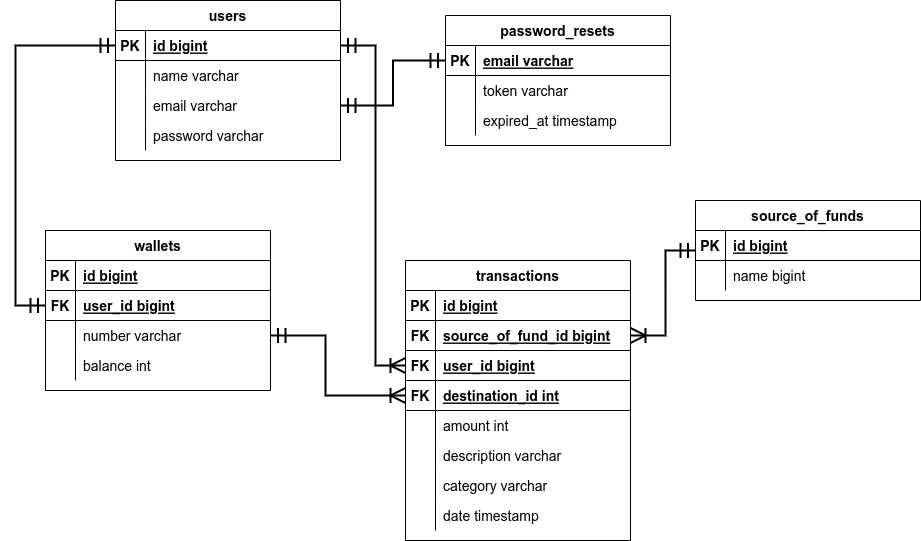

# E-Wallet API

## Description
This is a RESTful API of E-Wallet project. This project was built with golang, postgreSQL, and JWT authentication and implement clean architecture.

## Features
1. General Features
1. Authentication and Authorization
1. List of Transactions
1. Top Up
1. Transfer
1. User Details
1. Database SQL
1. Unit Testing
1. API documentation

## Database Design


## How To Run This Project
> Make Sure you have installed postgreSQL, Docker, and Make

#### Run the Applications
Here is the steps to run it with `docker`

```bash
#move to directory
$ cd workspace
# Clone the project
$ git clone https://git.garena.com/sea-labs-id/batch-02/aulia-nabil/assignment-05-golang-backend.git
#move to project
$ cd assignment-05-golang-backend
# Create the database and running the seeder
$ make db
# setup .env file
$ cp env.example .env
# Build the docker image first
$ make image
# Run the application
$ make run
# check if the containers are running
$ docker ps
# Stop
$ make stop
```
#### Run Application For Development

```bash
$ make dev
```

#### Run the Testing

```bash
$ make test
```

#### User Credentials
```json
[
    {
        "email": "nabil@user.com",
        "password": "12345",
    },
    {
        "email": "mario@user.com",
        "password": "12345",
    },
    {
        "email": "gerald@user.com",
        "password": "12345",
    },
    {
        "email": "arkin@user.com",
        "password": "12345",
    },
    {
        "email": "azmi@user.com",
        "password": "12345",
    },
]
```

### Tools Used:
In this project, I use some tools listed below. But you can use any simmilar library that have the same purposes. But, well, different library will have different implementation type.

- All libraries listed in [`go.mod`](https://go.mod)
- ["github.com/vektra/mockery".](https://github.com/vektra/mockery) To Generate Mocks for testing needs.
- ["github.com/swagger-api/swagger-ui".](https://github.com/swagger-api/swagger-ui) To Make API Documentation
